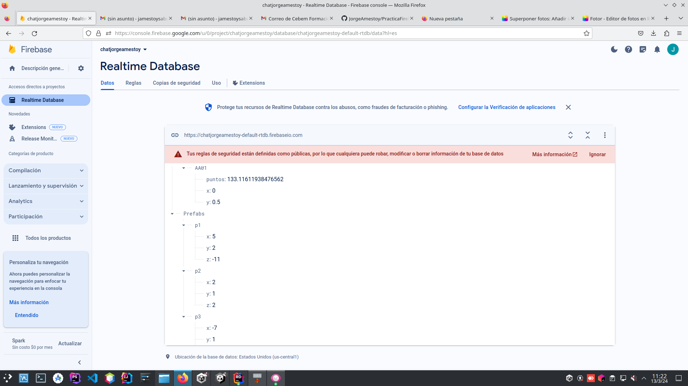
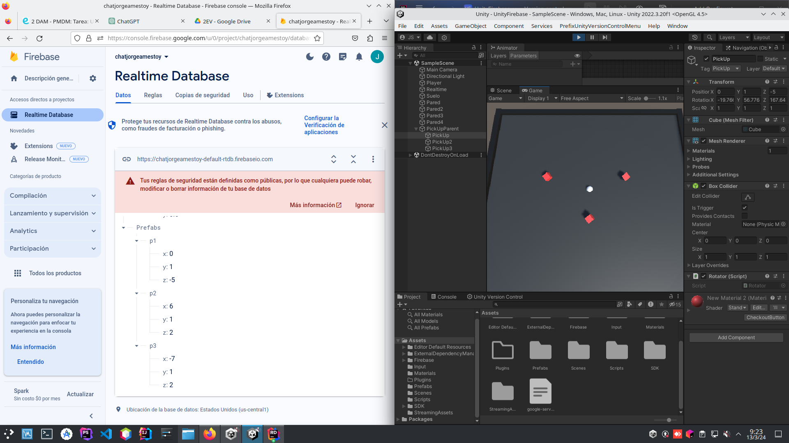
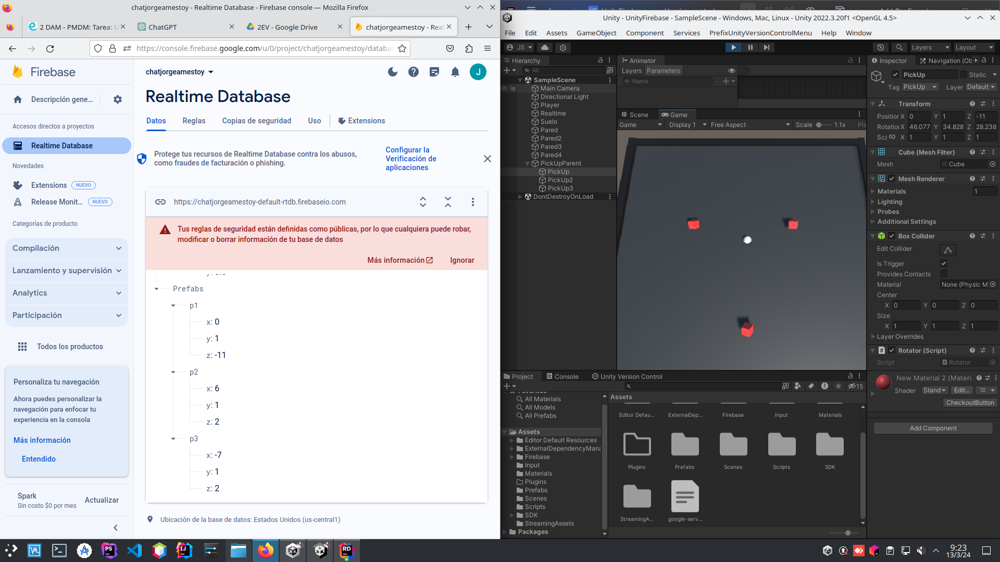
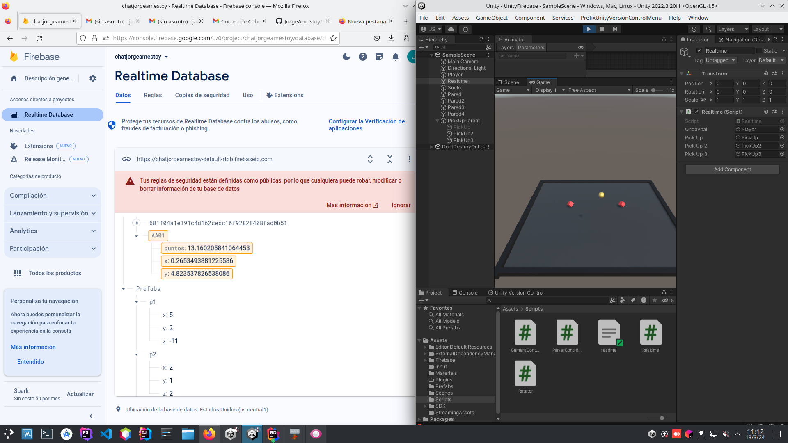

# PRÁCTICA FIREBASE


**Firebase** es una plataforma de desarrollo de aplicaciones móviles y web que entre sus servicios destaca una base de datos en tiempo real. Esta se utiliza para almacenar y sincronizar datos, en este caso, con Unity.<br>
Así, en el apartado de **Realtime Database** podemos crear una base de datos con los datos requeridos para juego:<br><br>
<br><br>
Para asociar esta base de datos con Unity hay que descargar un **fichero de credenciales** y el **SDK** para usar bibliotecas y herramientas que permitan interactuar con Firebase,
y colocarlos en la carpeta de **Assets** de Unity.


## 1. En el inicio del juego, recoger las posiciones de varios elementos (los prefab) y posicionarlos en función de los datos de la base de datos

Para ello, creo un **objeto vacío** al que le asociao el Script [**Realtime**](Realtime.cs).<br>
Después, en el Inspector de Unity, asigno a cada **pickUp** el campo correspondiente que se menciona en el script, 
estableciendo las referencias necesarias para que funcione.

### START()
```
# Defino referencias
_refPrefabs = _db.GetReference("Prefabs");
_refp1 = _db.GetReference("Prefabs/p1");
_refp2 = _db.GetReference("Prefabs/p2");
_refp3 = _db.GetReference("Prefabs/p3");

// Recojo los valores
      _refPrefabs.GetValueAsync().ContinueWithOnMainThread(task => {
          if (task.IsFaulted) {
          }
          else if (task.IsCompleted) {
              DataSnapshot snapshot = task.Result;
              RecorreResultado(snapshot);

          }
      });
      
// Manejo eventos
      _refAA002.ValueChanged += HandleValueChanged;
      _refp1.ValueChanged += HandleValueChanged_prefabs;
      _refp2.ValueChanged += HandleValueChanged_prefabs;
      _refp3.ValueChanged += HandleValueChanged_prefabs;
```

### HandleValueChanged_prefabs()

Este método se activa cuando los datos de un objeto pickUp cambian en la base de datos. Su propósito es actualizar la posición de los 
prefab en **Unity** en tiempo real.
```
 void HandleValueChanged_prefabs(object sender, ValueChangedEventArgs args) {

      // Obtengo el nombre del pickup desde la referencia que disparó el evento
      string pickupName = args.Snapshot.Key;


      // Obtengo la posición del pickup desde la base de datos
      float x = float.Parse(args.Snapshot.Child("x").Value.ToString());
      float y = float.Parse(args.Snapshot.Child("y").Value.ToString());
      float z = float.Parse(args.Snapshot.Child("z").Value.ToString());

      // Actualizo la posición del pickup correspondiente en Unity
      switch (pickupName) {
          case "p1":
              pickUp.transform.position = new Vector3(x, y, z);
              break;
          case "p2":
              pickUp2.transform.position = new Vector3(x, y, z);
              break;
          case "p3":
              pickUp3.transform.position = new Vector3(x, y, z);
              break;
          default:
              Debug.LogError("Pickup desconocido: " + pickupName);
              break;
      }
  }
```
<br>
Aquí el pickUp1 (**p1**) se encuentra en las coordenadas **x=0, y=1, z=-5**<br><br>

Cuando las modifico en Firebase (cambio **z** de -5 a -11), el objeto se desplaza a una nueva posición en Unity.<br>
### 2.Actualizar datos en la base de datos segun avance el juego, por ejemplo, los puntos recogidos, las vidas, etc. Esto tiene que ser particular para cada jugador.
En este apartado lo que hago es actualizar en la base de datos la posición del **Player**.<br>
Para ello modifico el método **update()**:
```
// Obtengo la posición x e y del player
double playerx = ondavital.transform.position.x; 
double playery = ondavital.transform.position.y;

 //Actualizo las posiciones en la base de datos
 _refJugadores.Child("AA01").Child("x").SetValueAsync(playerx);
 _refJugadores.Child("AA01").Child("y").SetValueAsync(playery); 
```

Como se puede apreciar en la captura, los cambios en la posición de la bola, tanto en el eje **x** como en el **y**, se actualizan en tiempo real en la base de datos.

### 3. Actualizar en tiempo real lo que ocurre en el juego. Guardar la posicion de un objeto, y usarla. Pensar en dos bolas, cada una, la mueve un jugador diferente. ¿Como sería moverlas tomando los valores de la base de datos?
Dentro de **Assets** un compañero sustituye el archivo **google-services.json**, el cual gestiona las credenciales de conexión a **Firebase**,
por el mío. Esto significa que cualquier acción que realice en Unity se reflejará en mi base de datos.
